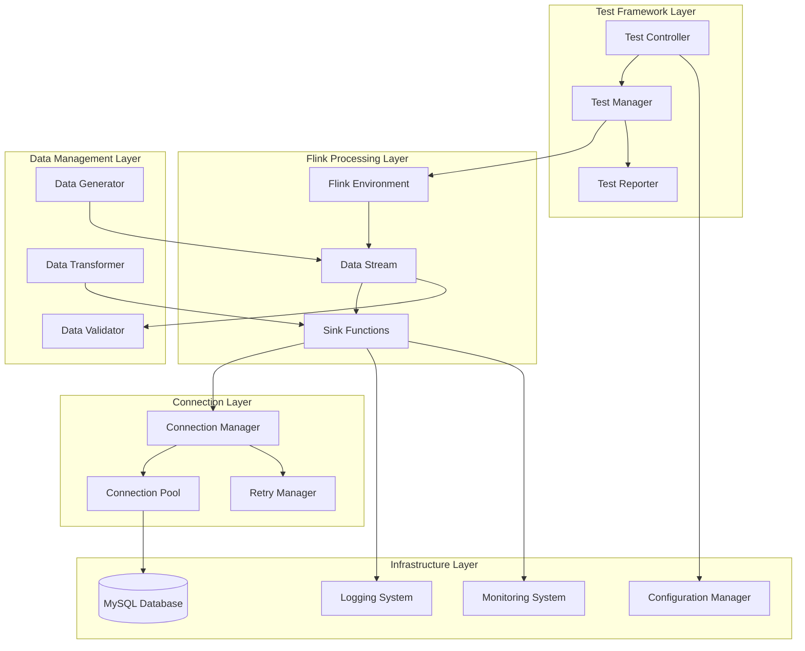

# Design Document

## Overview

This design document outlines the architecture and implementation approach for a comprehensive Flink MySQL connector test case. The system will provide a robust, configurable, and maintainable testing framework that validates Flink's ability to stream data to MySQL databases reliably. The design builds upon existing successful implementations while addressing identified gaps in error handling, performance monitoring, and data validation.

The test case will serve as both a validation tool and a reference implementation for production Flink-MySQL integrations. It will demonstrate best practices for connection management, error handling, and performance optimization while providing comprehensive logging and monitoring capabilities.

## Architecture

The system follows a layered architecture with clear separation of concerns:



### Key Architectural Principles

1. **Modularity**: Each component has a single responsibility and well-defined interfaces
2. **Configurability**: All aspects of the system can be configured externally
3. **Resilience**: Built-in error handling, retry mechanisms, and graceful degradation
4. **Observability**: Comprehensive logging, metrics, and monitoring capabilities
5. **Extensibility**: Easy to add new test scenarios and data types

## Components and Interfaces

### Test Framework Components

#### TestController
- **Purpose**: Orchestrates test execution and manages test lifecycle
- **Key Methods**:
  - `initialize_test_environment()`: Sets up Flink environment and dependencies
  - `execute_test_suite()`: Runs all configured test scenarios
  - `cleanup_resources()`: Cleans up test data and connections
- **Dependencies**: Configuration Manager, Test Manager, Test Reporter

#### TestManager
- **Purpose**: Manages individual test scenarios and coordinates execution
- **Key Methods**:
  - `create_test_scenario(scenario_config)`: Creates specific test scenarios
  - `validate_test_results()`: Validates test outcomes against expected results
  - `handle_test_failure(error)`: Manages test failure scenarios
- **Dependencies**: Data Generator, Data Validator, Flink Environment

#### TestReporter
- **Purpose**: Generates test reports and performance metrics
- **Key Methods**:
  - `generate_test_report()`: Creates comprehensive test reports
  - `export_metrics()`: Exports performance metrics
  - `create_summary()`: Generates executive summary
- **Dependencies**: Monitoring System, Logging System

### Flink Processing Components

#### FlinkEnvironment
- **Purpose**: Manages Flink execution environment and configuration
- **Key Methods**:
  - `setup_environment(config)`: Configures Flink environment with JAR dependencies
  - `create_data_stream(source)`: Creates data streams from various sources
  - `add_sink(sink_config)`: Adds configured sinks to data streams
- **Dependencies**: Configuration Manager, JAR Dependencies

#### DataStream
- **Purpose**: Represents the data flow pipeline within Flink
- **Key Methods**:
  - `apply_transformations()`: Applies data transformations
  - `add_validation()`: Adds data validation steps
  - `configure_parallelism()`: Sets parallelism levels
- **Dependencies**: Data Transformer, Data Validator

#### SinkFunction
- **Purpose**: Handles data writing to MySQL with error handling
- **Key Methods**:
  - `invoke(value, context)`: Writes individual records to MySQL
  - `handle_error(error, value)`: Manages write errors and retries
  - `close()`: Cleans up resources on shutdown
- **Dependencies**: Connection Manager, Retry Manager, Logging System

### Data Management Components

#### DataGenerator
- **Purpose**: Generates test data with various characteristics
- **Key Methods**:
  - `generate_basic_data(count)`: Creates simple test records
  - `generate_complex_data(schema)`: Creates complex nested data structures
  - `generate_edge_cases()`: Creates edge case scenarios (nulls, large values, etc.)
- **Configuration**: Data volume, data types, distribution patterns

#### DataValidator
- **Purpose**: Validates data integrity and correctness
- **Key Methods**:
  - `validate_schema(data, expected_schema)`: Validates data schema compliance
  - `validate_constraints(data, constraints)`: Checks business rule constraints
  - `compare_source_target(source, target)`: Compares source and target data
- **Dependencies**: MySQL Database (for target validation)

#### DataTransformer
- **Purpose**: Transforms data between Flink and MySQL formats
- **Key Methods**:
  - `flink_to_mysql(flink_row)`: Converts Flink Row to MySQL-compatible format
  - `handle_type_conversion(value, target_type)`: Handles type conversions
  - `format_timestamps(timestamp)`: Formats timestamp values
- **Dependencies**: Type mapping configuration

### Connection Management Components

#### ConnectionManager
- **Purpose**: Manages MySQL database connections and transactions
- **Key Methods**:
  - `get_connection()`: Retrieves connection from pool
  - `execute_query(sql, params)`: Executes SQL with parameters
  - `manage_transaction(operations)`: Handles transaction boundaries
- **Dependencies**: Connection Pool, Configuration Manager

#### ConnectionPool
- **Purpose**: Manages database connection pooling for efficiency
- **Key Methods**:
  - `initialize_pool(config)`: Sets up connection pool
  - `acquire_connection()`: Gets connection from pool
  - `release_connection(connection)`: Returns connection to pool
- **Configuration**: Pool size, timeout settings, validation queries

#### RetryManager
- **Purpose**: Implements retry logic for failed operations
- **Key Methods**:
  - `execute_with_retry(operation, config)`: Executes operation with retry logic
  - `calculate_backoff(attempt)`: Calculates exponential backoff delays
  - `should_retry(error)`: Determines if error is retryable
- **Configuration**: Max retries, backoff strategy, retryable error types

## Data Models

### Test Configuration Model
```python
@dataclass
class TestConfiguration:
    mysql_config: MySQLConfig
    flink_config: FlinkConfig
    test_scenarios: List[TestScenario]
    performance_thresholds: PerformanceThresholds
    logging_config: LoggingConfig
```

### MySQL Configuration Model
```python
@dataclass
class MySQLConfig:
    host: str
    port: int
    database: str
    username: str
    password: str
    connection_pool_size: int = 10
    connection_timeout: int = 30
    charset: str = "utf8mb4"
```

### Test Scenario Model
```python
@dataclass
class TestScenario:
    name: str
    description: str
    data_generator_config: DataGeneratorConfig
    expected_results: ExpectedResults
    validation_rules: List[ValidationRule]
    performance_requirements: PerformanceRequirements
```

### Data Schema Models
```python
@dataclass
class FlinkRowSchema:
    fields: List[FieldDefinition]
    primary_key: Optional[str] = None
    
@dataclass
class MySQLTableSchema:
    table_name: str
    columns: List[ColumnDefinition]
    constraints: List[ConstraintDefinition]
    indexes: List[IndexDefinition]
```

### Performance Metrics Model
```python
@dataclass
class PerformanceMetrics:
    throughput_records_per_second: float
    latency_p95_ms: float
    error_rate_percentage: float
    connection_pool_utilization: float
    memory_usage_mb: float
    cpu_utilization_percentage: float
```

## Correctness Properties

*A property is a characteristic or behavior that should hold true across all valid executions of a system-essentially, a formal statement about what the system should do. Properties serve as the bridge between human-readable specifications and machine-verifiable correctness guarantees.*

### Connection Management Properties

**Property 1: Connection establishment reliability**
*For any* valid MySQL configuration, the Flink system should successfully establish a JDBC connection without throwing connection exceptions
**Validates: Requirements 1.1**

**Property 2: JAR dependency loading**
*For any* required MySQL connector JAR file, when loaded into the Flink environment, all necessary classes should be importable without ClassNotFoundException
**Validates: Requirements 1.2**

**Property 3: Invalid configuration error handling**
*For any* invalid MySQL configuration parameters, the system should return specific, descriptive error messages that identify the configuration problem
**Validates: Requirements 1.3**

**Property 4: Database unavailability resilience**
*For any* database unavailability scenario, the system should implement exponential backoff retry logic and eventually recover when the database becomes available
**Validates: Requirements 1.4**

**Property 5: Connection pool resource management**
*For any* connection pool configuration, the system should never exceed the maximum pool size and should efficiently reuse connections without resource leaks
**Validates: Requirements 1.5**

### Data Type and Integrity Properties

**Property 6: Type mapping correctness**
*For any* supported Flink data type, the system should correctly map it to the appropriate MySQL column type without data loss or type conversion errors
**Validates: Requirements 2.1**

**Property 7: ROW data integrity preservation**
*For any* Flink ROW data structure, field order and values should be preserved exactly during MySQL insertion
**Validates: Requirements 2.2**

**Property 8: NULL value handling**
*For any* data containing NULL values, the system should correctly insert NULL values into nullable MySQL columns without conversion errors
**Validates: Requirements 2.3**

**Property 9: Large text field handling**
*For any* text data within MySQL column limits, the system should insert the data without truncation or encoding errors
**Validates: Requirements 2.4**

**Property 10: Numeric precision preservation**
*For any* high-precision numeric data, the system should maintain exact precision when transferring DECIMAL and BIGINT values to MySQL
**Validates: Requirements 2.5**

### Error Handling and Resilience Properties

**Property 11: Constraint violation graceful handling**
*For any* primary key constraint violation, the system should log the error and continue processing subsequent records without stopping the entire stream
**Validates: Requirements 3.1**

**Property 12: SQL error recovery**
*For any* SQL syntax error, the system should log detailed error information and continue processing remaining valid records
**Validates: Requirements 3.2**

**Property 13: Network interruption recovery**
*For any* network interruption scenario, the system should detect the failure and implement connection recovery mechanisms to resume operations
**Validates: Requirements 3.3**

**Property 14: Data validation error logging**
*For any* data validation failure, the system should log specific field-level error information with sufficient detail for debugging
**Validates: Requirements 3.4**

**Property 15: Transaction boundary management**
*For any* configured batch size, the system should maintain proper transaction boundaries and provide ACID guarantees for batch operations
**Validates: Requirements 3.5**

### Monitoring and Logging Properties

**Property 16: Successful operation logging**
*For any* successful data insertion operation, the system should log record counts, timing information, and operation status
**Validates: Requirements 4.1**

**Property 17: Structured error logging**
*For any* error condition, the system should produce structured logs containing error codes, timestamps, and contextual information
**Validates: Requirements 4.2**

**Property 18: Performance metrics collection**
*For any* system operation, the system should accurately track and report throughput, latency, and error rate metrics
**Validates: Requirements 4.3**

**Property 19: Connection pool status logging**
*For any* connection pool state change, the system should log current pool statistics including active and idle connection counts
**Validates: Requirements 4.4**

**Property 20: Debug trace generation**
*For any* operation when debugging is enabled, the system should provide detailed execution traces sufficient for troubleshooting
**Validates: Requirements 4.5**

### Configuration and Environment Properties

**Property 21: External configuration loading**
*For any* valid configuration file, the system should correctly load and apply MySQL connection parameters from external sources
**Validates: Requirements 5.1**

**Property 22: Environment-specific configuration**
*For any* environment-specific configuration override, the system should apply the correct configuration for the target environment
**Validates: Requirements 5.2**

**Property 23: Dynamic JAR loading**
*For any* updated JAR dependency, the system should dynamically load new connector versions without requiring code changes
**Validates: Requirements 5.3**

**Property 24: Automatic schema management**
*For any* test scenario requiring database tables, the system should automatically create and manage the necessary database schemas
**Validates: Requirements 5.4**

**Property 25: Resource cleanup**
*For any* test execution, the system should provide complete cleanup of test data and release all allocated resources
**Validates: Requirements 5.5**

### Performance Properties

**Property 26: High-volume throughput consistency**
*For any* high-volume data stream, the system should maintain consistent throughput without memory leaks or performance degradation
**Validates: Requirements 6.1**

**Property 27: Batch size optimization**
*For any* configured batch size, larger batch sizes should result in improved insertion performance compared to smaller batch sizes
**Validates: Requirements 6.2**

**Property 28: Concurrent stream handling**
*For any* number of parallel data streams within system limits, the system should handle concurrent operations without connection conflicts
**Validates: Requirements 6.3**

**Property 29: Backpressure flow control**
*For any* backpressure condition, the system should implement flow control mechanisms that prevent system overload and maintain stability
**Validates: Requirements 6.4**

**Property 30: Minimum throughput benchmark**
*For any* standard test dataset, the system should achieve and maintain a minimum throughput of 1000 records per second
**Validates: Requirements 6.5**

### Data Processing Properties

**Property 31: JSON structure processing**
*For any* complex nested JSON structure, the system should correctly parse and flatten the data for relational storage without data loss
**Validates: Requirements 7.1**

**Property 32: Timestamp conversion accuracy**
*For any* Flink timestamp value, the system should correctly convert it to the appropriate MySQL DATETIME/TIMESTAMP format without precision loss
**Validates: Requirements 7.2**

**Property 33: UTF-8 encoding preservation**
*For any* UTF-8 encoded text including international characters, the system should preserve character encoding throughout the processing pipeline
**Validates: Requirements 7.3**

**Property 34: Streaming memory efficiency**
*For any* large dataset, the system should process data in streaming fashion with bounded memory usage regardless of dataset size
**Validates: Requirements 7.4**

**Property 35: Custom transformation support**
*For any* custom mapping function, the system should correctly apply the transformation and produce the expected output format
**Validates: Requirements 7.5**

## Error Handling

The system implements a comprehensive error handling strategy with multiple layers of resilience:

### Connection-Level Error Handling
- **Connection Failures**: Automatic retry with exponential backoff (max 3 retries, 1s, 2s, 4s delays)
- **Timeout Handling**: Configurable connection and query timeouts with graceful degradation
- **Pool Exhaustion**: Queue management with configurable wait times and overflow handling

### Data-Level Error Handling
- **Type Conversion Errors**: Detailed logging with field-level error information and data skipping
- **Constraint Violations**: Individual record error handling without stream interruption
- **Validation Failures**: Comprehensive validation with configurable error thresholds

### System-Level Error Handling
- **Resource Exhaustion**: Memory and connection monitoring with automatic cleanup
- **Network Interruptions**: Connection health checks and automatic reconnection
- **Configuration Errors**: Early validation with clear error messages and suggestions

## Testing Strategy

### Dual Testing Approach

The testing strategy employs both unit testing and property-based testing to ensure comprehensive coverage:

**Unit Testing Requirements:**
- Unit tests verify specific examples, edge cases, and error conditions
- Integration tests validate component interactions and end-to-end workflows
- Mock tests isolate components for focused testing
- Performance tests validate specific throughput and latency requirements

**Property-Based Testing Requirements:**
- Property tests verify universal properties across all valid inputs using **fast-check** library for JavaScript/TypeScript
- Each property-based test runs a minimum of 100 iterations to ensure statistical confidence
- Property tests are tagged with comments explicitly referencing design document properties
- Tag format: **Feature: flink-mysql-connector-test, Property {number}: {property_text}**
- Each correctness property is implemented by a single property-based test
- Property tests focus on invariants, round-trip properties, and metamorphic relationships

**Testing Framework Configuration:**
- Property-based testing library: **fast-check** (for TypeScript/JavaScript components)
- Unit testing framework: **pytest** (for Python components)
- Integration testing: **testcontainers** for MySQL database setup
- Performance testing: **JMeter** integration for load testing
- Test data generation: Custom generators for realistic data scenarios

**Test Categories:**
1. **Connection Tests**: Validate connection establishment, pooling, and error handling
2. **Data Type Tests**: Verify type mapping and conversion accuracy
3. **Performance Tests**: Validate throughput, latency, and resource usage
4. **Resilience Tests**: Test error handling, recovery, and fault tolerance
5. **Integration Tests**: End-to-end workflow validation
6. **Regression Tests**: Prevent introduction of known issues