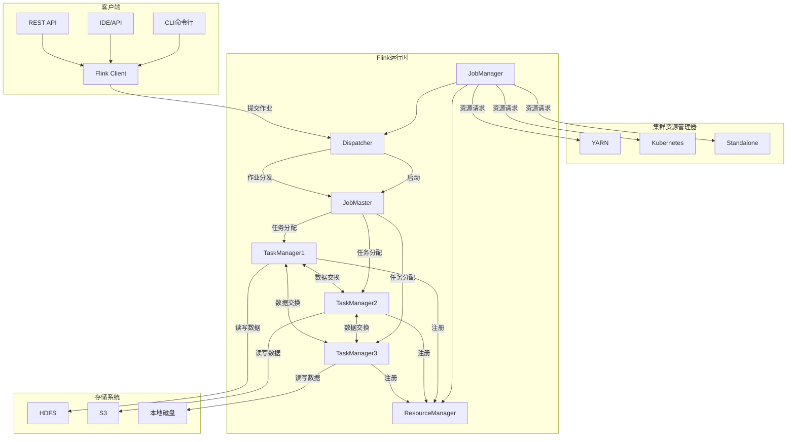
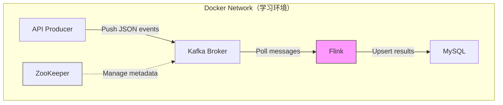
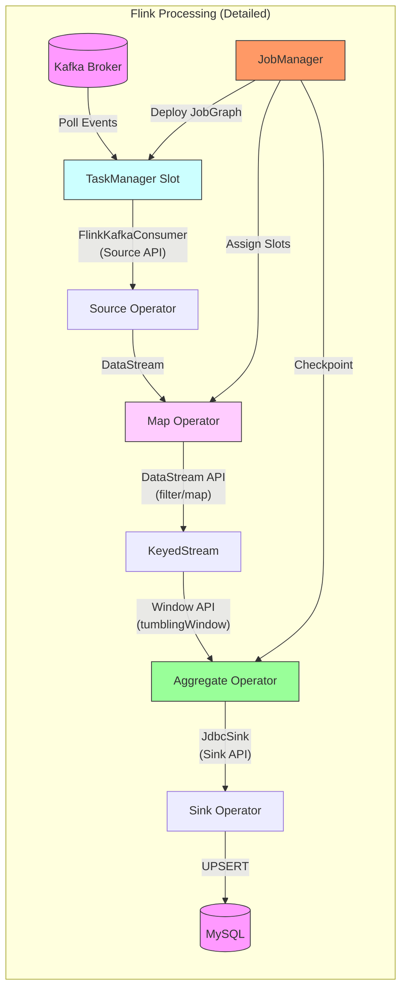
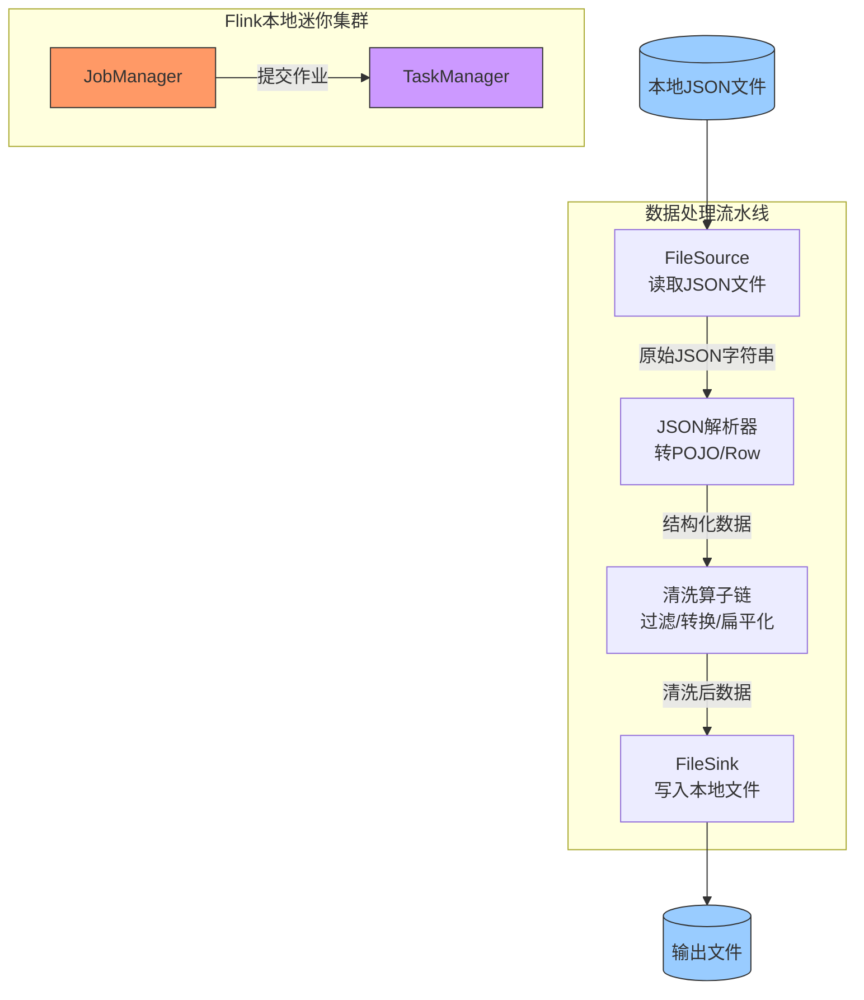

## 1.Flink基础概念

Apache Flink 是一个 **分布式流处理框架**，专为 **有状态计算的流数据** 设计，同时支持批处理（将批数据视为有限的流）。

### 1.1解决传统计算架构的痛点

- 实时性瓶颈: 传统批处理（如Hadoop）延迟达小时级，无法满足实时监控、风控等场景
- 流批分离成本高: Lambda架构需维护两套代码（实时+离线），开发运维复杂
- 状态管理薄弱: 传统流处理（如Storm）难以保证精确一次（Exactly-Once）语义

###  1.2核心功能与作用

| **功能模块**     | **解决的问题**           | **典型场景**           |
| ---------------- | ------------------------ | ---------------------- |
| **低延迟流处理** | 毫秒级响应实时数据       | 欺诈检测、实时告警     |
| **流批一体引擎** | 同一套API处理流/批数据   | T+0实时报表、数据补全  |
| **精确状态管理** | 故障恢复后数据不丢不重   | 金融交易对账、精准计费 |
| **事件时间处理** | 处理乱序数据保证结果准确 | 物联网设备数据分析     |

### 1.3关键应用场景

- 实时数据管道（ETL）：将 Kafka 数据实时清洗后写入数仓（如 HBase/ClickHouse）， 分钟级数据可见性
- 实时监控与告警：检测服务器指标（如 CPU > 90% 持续 1分钟）
- 金融风控：毫秒级识别异常交易模式（如短时间内多笔大额转账）
- 实时推荐系统：根据用户实时行为（点击/购买）更新推荐结果

总结：实现需要 **低延迟、强一致性、复杂状态管理** 的实时计算场景

### 1.4Flink有状态计算本质

**“有状态”不仅依赖历史数据，还涵盖所有需要跨数据记录（或跨时间）维护中间信息的场景**。其本质是 **算子（Operator）在处理数据时需要记住某些上下文信息**，这些信息可能来自历史数据，也可能是程序运行中的临时状态。

| **状态类型**       | **说明**                                             | **示例**                             |
| ------------------ | ---------------------------------------------------- | ------------------------------------ |
| **显式历史数据**   | 直接依赖之前处理过的数据计算结果。                   | 用户点击量累加、滑动窗口平均值。     |
| **隐式上下文信息** | 依赖程序运行中生成的中间状态（可能与历史数据无关）。 | Kafka 消费偏移量、机器学习模型参数。 |
| **外部系统交互**   | 通过状态缓存外部数据，减少重复访问（如维表关联）。   | 用户画像缓存、商品价格快照。         |


## 2.Flink架构与组件

### 2.1Flink架构与组件功能 

flink核心组件只有 JobManager 和 TaskManager，为了方便理解整个作业流程，下面给出整个作业组件

**1. 客户端（Client）**

| 组件             | 功能职责                                                     | 关键特性                        |
| ---------------- | ------------------------------------------------------------ | ------------------------------- |
| **CLI命令行**    | 通过命令行提交作业（`flink run`）、取消作业、查看日志。      | 适合运维人员快速操作。          |
| **IDE/API**      | 开发者在代码中直接调用 Flink API（DataStream/Table API）构建作业逻辑。 | 支持 Java/Scala/Python。        |
| **REST API**     | 提供 HTTP 接口提交作业、获取集群状态，集成到外部系统（如调度平台）。 | 适合自动化运维场景。            |
| **Flink Client** | 将用户代码编译为**逻辑执行计划（JobGraph）**，提交给 JobManager。 | 优化 DAG 结构（如算子链合并）。 |

**2. 集群资源管理器**

| 组件           | 功能职责                                      | 适用场景                               |
| -------------- | --------------------------------------------- | -------------------------------------- |
| **YARN**       | 动态分配容器资源，管理 TaskManager 生命周期。 | Hadoop 生态集成，资源利用率高。        |
| **Kubernetes** | 原生容器化部署，支持弹性扩缩容和故障恢复。    | 云原生环境（如 AWS EKS、阿里云 ACK）。 |
| **Standalone** | Flink 内置的简单资源管理模式，无需外部依赖。  | 测试/开发环境快速启动。                |

底层资源平台（如 YARN、Kubernetes、Mesos），实现提供物理资源（CPU/内存），并按需启动/销毁容器（Container/Pod）

**3. Flink 运行时核心组件**

| 组件                    | 功能职责                                                     | 关键机制                                      |
| ----------------------- | ------------------------------------------------------------ | --------------------------------------------- |
| **JobManager**          | 集群主节点，协调作业执行的核心组件。                         | 高可用需依赖 ZooKeeper。                      |
| 子组件: ResourceManager | 管理 TaskManager 资源池，与外部资源框架（YARN/K8s）交互。    | 支持 Slot 动态分配。                          |
| 子组件:  Dispatcher     | 接收客户端作业提交，启动 JobMaster，提供 Web UI。            | 多租户环境下路由不同作业到对应 JobMaster。    |
| 子组件:  JobMaster      | 管理单个作业的生命周期（生成物理执行图、调度 Task、故障恢复）。 | 每个作业独立 JobMaster。                      |
| **TaskManager**         | 工作节点，执行具体 Task，管理内存状态和网络通信。            | 通过 Slot 划分资源。                          |
| 子组件:  Task Slot      | 资源隔离单元，一个 Slot 可运行多个算子链（共享 CPU/内存）。  | 提高资源利用率（如 1 Slot 运行 map→filter）。 |
| 子组件:  Network Stack  | 处理 TaskManager 间的数据传输（Shuffle）、反压控制、零拷贝优化。 | 关键影响吞吐和延迟。                          |

**4. 存储系统**

| 组件         | 功能职责                                         | 典型用途                           |
| ------------ | ------------------------------------------------ | ---------------------------------- |
| **HDFS**     | 存储 Checkpoint/Savepoint 状态快照，支持高容错。 | 大数据生态集成（如 Hadoop 环境）。 |
| **S3**       | 云原生存储，适合存放大规模状态数据。             | AWS/阿里云等云平台。               |
| **本地磁盘** | 临时存储状态数据，性能高但可靠性低。             | 测试环境或非关键作业。             |


### 2.2Flink架构工作流程

| 作业阶段                      | 参与组件                                                     | 流程步骤                                                     |
| ----------------------------- | ------------------------------------------------------------ | ------------------------------------------------------------ |
| **1. 作业提交阶段**           | 客户端（CLI/IDE/REST API）、Flink Client、Dispatcher         | 1. 用户通过客户端提交作业到 Flink Client。 <br />2. Flink Client 将作业（JAR/SQL）传递给 Dispatcher（JobManager 入口）。 |
| **2. 作业初始化阶段**         | Dispatcher、JobMaster、ResourceManager                       | 3. Dispatcher 创建 JobMaster（每个作业一个实例）。<br />4. JobMaster 解析作业 DAG，并向 ResourceManager 申请资源（Slot）。 |
| **3. 资源分配阶段**           | ResourceManager、集群资源管理器（YARN/K8s/Standalone）、TaskManager | 5. ResourceManager 与底层集群协商，启动 TaskManager 容器/Pod。 <br />6. TaskManager 启动后向 ResourceManager 注册 Slot（资源信息）。 |
| **4. 任务调度与执行阶段**     | JobMaster、TaskManager                                       | 7. JobMaster 将 Task 分配到 TaskManager 的 Slot 上。 <br />8. TaskManager 执行 Task，并与其他 TaskManager 交换数据（如 Shuffle）。 |
| **5. 数据读写阶段**           | TaskManager、存储系统（HDFS/S3/本地磁盘）                    | 9. TaskManager 从外部存储（如 HDFS/Kafka）读取输入数据。 <br />10. 处理完成后将结果写入存储系统（如 S3/数据库）。 |
| **6. 容错与协调**（隐含流程） | JobMaster、TaskManager、检查点存储                           | - JobMaster定期触发 Checkpoint，TaskManager 保存状态快照。 <br />- 故障时，JobMaster 重新调度 Task 并从检查点恢复状态。 |



### 2.3Flink运行模式

#### 1.按部署环境划分

| 环境   | 模式类型        | 特点                                                         | 应用场景                                                   | 涉及工具                      |
| ------ | --------------- | ------------------------------------------------------------ | ---------------------------------------------------------- | ----------------------------- |
| 本地   | 本地模式        | 单 JVM 进程运行，无分布式集群，轻量级，适合开发调试          | 开发测试、教学演示                                         | 无（仅需 Flink 运行时环境）   |
| 集群   | 独立集群模式    | 专用 Flink 集群，无需依赖外部资源管理器，手动管理，固定资源  | 小规模生产环境、测试环境、资源隔离需求高的场景             | Flink 自身管理工具            |
| 集群   | YARN 会话模式   | 与 Hadoop YARN 集成，共享集群资源，预先启动集群，多作业共享资源 | 已有 Hadoop 集群、需统一资源管理、批流混合部署             | Hadoop YARN、Flink            |
| 集群   | YARN 应用模式   | 与 Hadoop YARN 集成，每个作业一个独立集群，资源隔离性好      | 资源隔离要求高的作业                                       | Hadoop YARN、Flink            |
| 集群   | Kubernetes 模式 | 云原生部署，容器化管理，支持弹性伸缩和声明式配置             | 云环境（如 AWS EKS、Google GKE）、DevOps 流程集成（CI/CD） | Kubernetes、Docker、Flink     |
| 云服务 | 云托管服务      | 完全托管，无需管理基础设施，与云生态深度集成                 | 云环境下无需管理基础设施、需快速搭建实时数据处理的场景     | 各云服务商平台（AWS、GCP 等） |
| 嵌入   | 嵌入模式        | Flink 作为库集成到应用程序中，无独立集群，与应用共享 JVM 资源 | 微服务中集成实时计算功能、资源受限环境下的轻量级流处理     | Flink 运行时库                |

| **模式**      | **资源管理**    | **启动速度** | **资源利用率** | **隔离性** | **适用场景**           |
| ------------- | --------------- | ------------ | -------------- | ---------- | ---------------------- |
| 本地模式      | 单 JVM          | 极快         | 低             | 无         | 开发调试               |
| Standalone    | 独立 Flink 集群 | 较慢         | 中             | 中         | 专用集群、小规模生产   |
| YARN 会话模式 | Hadoop YARN     | 中等         | 高             | 低         | 共享资源、多作业调度   |
| YARN 应用模式 | Hadoop YARN     | 较慢         | 高             | 高         | 资源隔离要求高的作业   |
| Kubernetes    | 容器编排平台    | 中等         | 高             | 高         | 云原生、弹性伸缩       |
| 云托管服务    | 云服务商管理    | 快           | 高             | 高         | 无需管理基础设施的场景 |
| 嵌入模式      | 应用程序自身    | 快           | 低             | 低         | 微服务集成、嵌入式系统 |

#### 2.按集群生命周期划分

**Session 模式(会话模式）**

Session 模式假设已有一个正在运行的集群，并使用该集群的资源来执行任何提交的应用程序。

优点: 共享集群资源，避免了为每个提交的作业启动一个完整集群所带来的资源开销。

缺点：资源隔离性差，多个作业竞争 Slot，资源分配动态调整

**Per-Job 模式（单作业模式）已废弃** 

每个作业独占集群 , 强资源隔离 , 作业完成即释放资源

**Application 模式（应用模式）** 

应用级资源共享，多作业协作，依赖包在集群内共享

**优点**: 避免依赖重复上传 

**缺点**:  仅支持 Flink 1.11+


## 3.Flink开发环境搭建

### 3.1单机模式(开发测试)

#### 1.搭建flink单机环境

```bash
# 启动JobManager + Web UI
docker run -d --name flink-jobmanager \
  -p 8081:8081 \
  -e FLINK_PROPERTIES="jobmanager.rpc.address=jobmanager" \
  apache/flink:1.17.1-scala_2.12-java11 jobmanager

# 启动TaskManager（连接到JobManager）
docker run -d --name flink-taskmanager \
  --link flink-jobmanager:jobmanager \
  -e FLINK_PROPERTIES="jobmanager.rpc.address=jobmanager" \
  apache/flink:1.17.1-scala_2.12-java11 taskmanager
```

命令说明：

- jobmanager.rpc.address： JobManager 远程过程调用服务地址, 其他组件（如 TaskManager、客户端）都需要通过 RPC 地址与 JobManager 通信

- 命令末尾的 `jobmanager` 或 `taskmanager`:  指定 **Flink 容器的运行角色**, 为 jobmanager 或 taskmanager

验证是否安装成功：

- 访问 `http://localhost:8081`
- 查看日志：`docker logs flink-jobmanager`

#### 2.入门案例: WordCount示例

`apache/flink:1.17.1-scala_2.12-java11`并没有python环境，在


### 3.2构建python pyFlink 环境镜像

docker build -t flink-1.17.1-py3.9:latest

```dockerfile
FROM --platform=linux/amd64 apache/flink:1.17.1-scala_2.12-java11

# 安装基础依赖
RUN apt-get update && \
    apt-get install -y --no-install-recommends \
        python3 \
        python3-pip \
        python3-dev \
        libgomp1 && \
    rm -rf /var/lib/apt/lists/* && \
    ln -sf /usr/bin/python3 /usr/bin/python && \
    ln -sf /usr/bin/pip3 /usr/bin/pip

# 安装PyFlink及依赖（修正格式）
RUN pip install --upgrade pip && \
    pip install \
        apache-flink==1.17.1 \
        pyarrow==7.0.0 \
        pandas==1.3.5 \
        -i https://pypi.tuna.tsinghua.edu.cn/simple

# 环境变量
ENV PYTHONPATH=/opt/flink/opt/python
ENV PYFLINK_CLIENT_EXECUTABLE=python

```


```dockerfile
# 移除硬编码--platform，使用动态构建参数
FROM apache/flink:1.17.1-scala_2.12-java11

# 安装基础依赖（使用阿里云apt镜像加速）
RUN sed -i 's/deb.debian.org/mirrors.aliyun.com/g' /etc/apt/sources.list && \
    apt-get update && \
    apt-get install -y --no-install-recommends \
        python3 \
        python3-pip \
        python3-dev \
        libgomp1 && \
    rm -rf /var/lib/apt/lists/* && \
    ln -sf /usr/bin/python3 /usr/bin/python

# 安装Python依赖（清华镜像+并行优化）
RUN pip install --upgrade pip && \
    pip install \
        --index-url https://pypi.tuna.tsinghua.edu.cn/simple \
        --trusted-host pypi.tuna.tsinghua.edu.cn \
        --no-cache-dir \
        apache-flink==1.17.1 \
        pyarrow==7.0.0 \
        pandas==1.3.5

# 环境变量
ENV PYTHONPATH=/opt/flink/opt/python \
    PYFLINK_CLIENT_EXECUTABLE=python

```


### 3.3 flink-scala_2.12-java11-py3.8说明	

#### 创建 DataStream API 数据流处理环境

```python
from pyflink.datastream import StreamExecutionEnvironment
from pyflink.table import StreamTableEnvironment
data_stream_env = StreamExecutionEnvironment.get_execution_environment()
data_stream_table_env = StreamTableEnvironment.create(data_stream_env)
```

#### 创建 Table API 流处理表环境

```python
from pyflink.table import EnvironmentSettings, TableEnvironment
stream_env_settings = EnvironmentSettings.in_streaming_mode()
stream_table_env = TableEnvironment.create(stream_env_settings)
```

#### 创建Table API 批处理表环境

```python
from pyflink.table import EnvironmentSettings, TableEnvironment
batch_env_settings = EnvironmentSettings.in_batch_mode()
batch_table_env = TableEnvironment.create(batch_env_settings)
```

#### **JSON 文件读取**

```python
from pyflink.datastream import StreamExecutionEnvironment
from pyflink.datastream.connectors.file_system import FileSource
from pyflink.datastream.formats.json import JsonRowDeserializationSchema
from pyflink.common import Types, WatermarkStrategy

env = StreamExecutionEnvironment.get_execution_environment()
env.add_jars("file:///path/to/flink-connector-files-1.17.0.jar")  # 必须添加

# 定义数据类型
row_type = Types.ROW_NAMED(
    ["name", "age", "city"],
    [Types.STRING(), Types.INT(), Types.STRING()]
)

# 创建 JSON 反序列化器
json_deserializer = JsonRowDeserializationSchema.Builder() \
    .type_info(row_type) \
    .build()

# 构建 FileSource
source = FileSource.for_record_stream_format(
    json_deserializer,  # 直接使用反序列化器
    "file:///path/to/input.json"
).build()

ds = env.from_source(source, WatermarkStrategy.no_watermarks(), "json-source")
ds.print()
env.execute()

```

#### **CSV 文件读取**

```python
from pyflink.datastream.formats.csv import CsvReaderFormat

csv_format = CsvReaderFormat.for_row_type(
    row_type=Types.ROW_NAMED(
        ["name", "age"],
        [Types.STRING(), Types.INT()]
    ),
    field_delimiter=","
)

source = FileSource.for_stream_format(
    csv_format,
    "file:///path/to/input.csv"
).build()
```

#### **FileSink 示例写入文件**

```
from pyflink.datastream import StreamExecutionEnvironment
from pyflink.datastream.connectors.file_system import FileSink
from pyflink.common.serialization import Encoder
from pyflink.common import Types

env = StreamExecutionEnvironment.get_execution_environment()
env.add_jars("file:///path/to/flink-connector-files-1.17.0.jar")  # 必须依赖

# 示例数据流
ds = env.from_collection([("Alice", 25), ("Bob", 30)], Types.ROW([Types.STRING(), Types.INT()]))

# 定义 FileSink
sink = FileSink.for_row_format(
    "file:///path/to/output",
    Encoder.simple_string_encoder()
).build()

ds.sink_to(sink)
env.execute("FileSink Example")
```

#### **KafkaSource或KafkaSink**

```python
from pyflink.datastream import StreamExecutionEnvironment
from pyflink.datastream.connectors.kafka import KafkaSource, KafkaSink
from pyflink.common.serialization import JsonRowDeserializationSchema, JsonRowSerializationSchema
from pyflink.common import Types, WatermarkStrategy

env = StreamExecutionEnvironment.get_execution_environment()
env.add_jars(
    "file:///path/to/flink-connector-kafka-1.17.0.jar",
    "file:///path/to/flink-json-1.17.0.jar"
)

# KafkaSource（消费数据）
row_type = Types.ROW_NAMED(["name", "age"], [Types.STRING(), Types.INT()])
kafka_source = KafkaSource.builder() \
    .set_bootstrap_servers("localhost:9092") \
    .set_topics("input-topic") \
    .set_value_only_deserializer(
        JsonRowDeserializationSchema.Builder().type_info(row_type).build()
    ) \
    .build()

# KafkaSink（生产数据）
serialization_schema = JsonRowSerializationSchema.Builder().with_type_info(row_type).build()
kafka_sink = KafkaSink.builder() \
    .set_bootstrap_servers("localhost:9092") \
    .set_record_serializer(
        KafkaRecordSerializationSchema.builder()
            .set_topic("output-topic")
            .set_value_serialization_schema(serialization_schema)
            .build()
    ) \
    .build()

# 构建流水线
ds = env.from_source(kafka_source, WatermarkStrategy.no_watermarks(), "Kafka Source")
ds.sink_to(kafka_sink)
env.execute("Kafka Example")

```

#### **Table API 连接器（DDL 方式）**

```python
from pyflink.table import EnvironmentSettings, TableEnvironment

t_env = TableEnvironment.create(EnvironmentSettings.in_streaming_mode())

# Kafka Source Table
t_env.execute_sql("""
    CREATE TABLE kafka_source (
        name STRING,
        age INT
    ) WITH (
        'connector' = 'kafka',
        'topic' = 'input-topic',
        'properties.bootstrap.servers' = 'localhost:9092',
        'format' = 'json'
    )
""")

# FileSystem Sink Table
t_env.execute_sql("""
    CREATE TABLE fs_sink (
        name STRING,
        age INT
    ) WITH (
        'connector' = 'filesystem',
        'path' = 'file:///path/to/output',
        'format' = 'csv'
    )
""")

# 执行 ETL
t_env.execute_sql("INSERT INTO fs_sink SELECT * FROM kafka_source")

```


### 3.4Flink1.17.1部署JDBC连接

需要的jar包如下：

[mysql-connector-java-8.0.27.jar](https://repo1.maven.org/maven2/mysql/mysql-connector-java/8.0.28/mysql-connector-java-8.0.28.jar)
[flink-connector-jdbc-3.1.1-1.17.jar](https://repo1.maven.org/maven2/org/apache/flink/flink-connector-jdbc/3.1.1-1.17/flink-connector-jdbc-3.1.1-1.17.jar)


## 4.Flink编程模型

### 4.1Flink API合集及适用场景

| API 名称               | 功能或作用                                                   | 适用场景                                                     |
| ---------------------- | ------------------------------------------------------------ | ------------------------------------------------------------ |
| **DataStream API**     | 提供低阶流处理操作（map/filter/window等），支持精确一次语义和状态管理 | 实时流处理（如点击流分析、实时风控）、需要精细控制时间和状态的场景 |
| **DataSet API**        | 批处理操作（已废弃，推荐使用 Table API 替代）                | 离线批处理（历史数据分析），Flink 1.12+ 后不推荐新项目使用   |
| **Table API & SQL**    | 声明式 API，统一流批处理，支持 ANSI SQL 和关系型操作         | 快速开发分析应用（如ETL）、需要流批一体化的场景、SQL 兼容需求 |
| **Stateful Functions** | 跨服务的状态管理，支持事件驱动架构和消息路由                 | 微服务应用、分布式事务处理、需要持久化跨函数状态的场景       |
| **CEP API**            | 复杂事件模式检测（如连续事件序列匹配）                       | 风险监控（如异常登录检测）、物联网设备异常模式识别           |
| **PyFlink API**        | Python 接口，支持 DataStream 和 Table API                    | Python 生态集成、机器学习管道、快速原型开发                  |
| **Process Function**   | 最底层 API，可访问时间戳、水位线和状态后端                   | 需要自定义复杂处理逻辑（如自定义窗口）、与外部系统深度集成的场景 |
| **Connector API**      | 与外部系统交互的源（Source）和汇（Sink）实现                 | 对接 Kafka/HDFS/JDBC 等外部系统、自定义数据源/目的地         |
| **Metrics API**        | 暴露运行时指标（吞吐量、延迟等）                             | 性能监控、自动化扩缩容、作业调优                             |

### 4.2DataStream API 核心组件

#### 1.DataStream API核心作用

- 处理无界数据流: 支持实时处理源源不断的数据流（如日志、传感器数据、用户行为等），而非批处理静态数据集。
- 精确的时间语义: 提供事件时间（Event Time）、处理时间（Processing Time）和摄入时间（Ingestion Time）三种时间语义，解决数据乱序问题。
- 状态管理与容错: 支持跨任务保存和恢复状态（如计数器、窗口聚合结果），结合 Checkpoint 机制实现 Exactly-Once 语义。
- 低延迟与高吞吐: 通过优化的执行引擎，在保证低延迟的同时处理高并发数据（如每秒百万级事件）。

#### 2.设置执行环境

##### 执行环境作用

- 程序入口: **设置执行环境（Execution Environment）是所有 Flink 程序的入口点**
- 配置执行参数（并行度、容错策略）。

##### 三种执行环境

| **执行环境**                                 | **适用场景**                                                 | **特点**                                                     |
| -------------------------------------------- | ------------------------------------------------------------ | ------------------------------------------------------------ |
| `StreamExecutionEnvironment`<br />流处理环境 | - 标准流处理环境（默认）<br />- 通用场景（开发、测试、生产） | - 自动检测执行环境（本地或集群） <br />- 支持批流一体 - 生产环境常用 |
| `LocalEnvironment`<br />本地调试环境         | 本地测试/调试                                                | - 在本地 JVM 中运行 - 不依赖集群 <br />- 可设置并行度模拟分布式行为 |
| `RemoteEnvironment`<br />连接远程集群        | 连接远程集群执行                                             | - 提交作业到远程集群（如 YARN/K8s） <br />- 需指定集群地址和 Jar 包路径 |

##### 参数及示例

| **参数/方法**                                    | **作用**                                         | **默认值**          | **示例/推荐值**                                           |
| ------------------------------------------------ | ------------------------------------------------ | ------------------- | --------------------------------------------------------- |
| `env.set_parallelism(n)`                         | 设置作业全局并行度                               | 1                   | `set_parallelism(4)`                                      |
| `operator.set_parallelism(n)`                    | 设置单个算子并行度（覆盖全局）                   | 继承全局值          | `map(...).set_parallelism(2)`                             |
| `env.default_parallelism`                        | 获取或设置默认并行度（未显式指定时生效）         | 1                   | `default_parallelism = 4`                                 |
| `env.enable_checkpointing(interval, mode)`       | 开启 Checkpoint（间隔和模式）                    | 未启用              | `enable_checkpointing(10000, EXACTLY_ONCE)`               |
| `set_checkpointing_mode(mode)`                   | 设置一致性模式（`EXACTLY_ONCE`/`AT_LEAST_ONCE`） | `EXACTLY_ONCE`      | `set_checkpointing_mode(AT_LEAST_ONCE)`                   |
| `set_checkpoint_timeout(timeout_ms)`             | Checkpoint 超时时间（超时则丢弃）                | 600000 ms（10分钟） | `set_checkpoint_timeout(300000)`                          |
| `set_min_pause_between_checkpoints(interval_ms)` | 两次 Checkpoint 最小间隔（防重叠）               | 0（无间隔）         | `set_min_pause_between_checkpoints(5000)`                 |
| `set_max_concurrent_checkpoints(n)`              | 最大并发 Checkpoint 数                           | 1                   | `set_max_concurrent_checkpoints(2)`                       |
| `enable_externalized_checkpoints(cleanup_mode)`  | 外部化 Checkpoint（任务停止后保留）              | 未启用              | `enable_externalized_checkpoints(RETAIN_ON_CANCELLATION)` |
| `set_fail_on_checkpointing_errors(bool)`         | Checkpoint 失败时是否使任务失败                  | `True`              | `set_fail_on_checkpointing_errors(False)`                 |
| `state.backend`                                  | 状态后端实现（通过 `Configuration` 设置）        | 无                  | `filesystem`/`rocksdb`                                    |
| `state.checkpoints.dir`                          | Checkpoint 存储路径                              | 无                  | `file:///tmp/checkpoints`                                 |
| `state.backend.incremental`                      | 是否启用增量 Checkpoint（仅 RocksDB）            | `false`             | `config.set_boolean("...incremental", True)`              |
| `env.get_runtime_mode()`                         | 获取执行模式（`STREAMING`/`BATCH`）              | `STREAMING`         | `set_runtime_mode(BATCH)`                                 |
| `env.set_restart_strategy(...)`                  | 设置故障重启策略                                 | 无策略              | `fixed_delay_restart(3, 10000)`                           |

```python
from pyflink.datastream import StreamExecutionEnvironment

env = StreamExecutionEnvironment.get_execution_environment()
env.set_parallelism(4)  # 设置并行度
```

##### Checkpoint作用

Flink Checkpoint 是 Flink 实现**容错机制**的核心功能，它允许 Flink 在发生故障（如节点崩溃、网络中断）时，**自动恢复作业状态并继续处理数据**，确保数据一致性和处理的可靠性

- ##### 工用原理

| **阶段**            | **关键步骤**                          | **详细说明**                                                 | **可视化类比**     |
| ------------------- | ------------------------------------- | ------------------------------------------------------------ | ------------------ |
| **1. 触发**         | JobManager 发起指令                   | 定时（按 `interval`）或手动触发 Checkpoint 生成请求。        | ⏰ 定时闹钟         |
| **2. Barrier 注入** | 数据源插入 Barrier                    | 数据源（如 Kafka）在流中插入特殊标记（Barrier），将数据划分为不同 Checkpoint 批次。 | 🚧 水流中的分隔浮标 |
| **3. 状态快照**     | 算子异步保存状态                      | 算子收到 Barrier 后，立即将当前状态（如窗口计数、KV 状态）异步写入存储后端。 | 📸 快速拍照存档     |
| **4. Barrier 对齐** | 多输入算子等待对齐（仅 Exactly-Once） | 如 `join` 需等待所有输入流的 Barrier 到达，确保状态一致性。  | 🚦 多车道同时亮绿灯 |
| **5. 确认完成**     | 向 JobManager 发送 ACK                | 所有算子完成快照后，JobManager 标记该 Checkpoint 为成功，并记录元数据。 | ✅ 全员签到完毕     |
| **6. 故障恢复**     | 从最近 Checkpoint 恢复                | 任务失败时，重新加载状态并从 Barrier 对应位置重新消费数据（如 Kafka Offset）。 | ⏪ 游戏读档继续     |

- **Checkpoint 与 Savepoint 的区别**

| **特性**     | **Checkpoint**                    | **Savepoint**                |
| :----------- | --------------------------------- | ---------------------------- |
| **目的**     | 自动容错（故障恢复）              | 手动备份（升级、迁移、调试） |
| **触发方式** | 定时自动触发                      | 用户手动触发                 |
| **存储格式** | 可能为增量/内部格式（如 RocksDB） | 标准化格式（可移植）         |
| **生命周期** | 任务停止后默认删除                | 显式创建和删除               |
| **性能影响** | 低开销（异步+增量）               | 高开销（全量同步）           |

#### 3.读取数据源

**作用**：连接外部系统（如 Kafka、文件、Socket），生成初始`DataStream`。

**内置组件:**

| **Source 类型**            | **功能描述**                 |
| -------------------------- | ---------------------------- |
| `KafkaSource`              | 读取 Kafka 消息              |
| `FileSource`               | 读取文件（CSV、JSON 等）     |
| `SocketTextStreamFunction` | 从 Socket 接收数据           |
| `RichSourceFunction`       | 自定义数据源（如数据库轮询） |

**示例:**

```python
from pyflink.datastream.connectors import KafkaSource

source = KafkaSource.builder() \
    .set_bootstrap_servers("localhost:9092") \
    .set_topics("input_topic") \
    .set_group_id("my_group") \
    .build()

stream = env.from_source(source, watermark_strategy, "Kafka Source")
```

#### 4.数据清洗转换

**作用**：对数据流进行转换、过滤、聚合等处理。

**关键操作符**：

| 操作类型         | 功能描述                                     | 示例                                                         |
| ---------------- | -------------------------------------------- | ------------------------------------------------------------ |
| `map`            | 一对一转换（如字符串转整数）。               | `stream.map(lambda x: x * 2)`                                |
| `filter`         | 过滤满足条件的元素。                         | `stream.filter(lambda x: x > 10)`                            |
| `keyBy`          | 按指定字段分组（类似 SQL 的 GROUP BY）。     | `stream.keyBy(lambda x: x.user_id)`                          |
| `reduce`         | 分组内聚合（如求和、最大值）。               | `stream.keyBy(...).reduce(sum)`                              |
| `window`         | 定义时间或计数窗口（如滚动窗口、滑动窗口）。 | `stream.window(TumblingEventTimeWindows.of(Time.seconds(5)))` |
| `join`/`connect` | 连接两个流（基于时间或条件）。               | `stream.join(other_stream).where(...).equalTo(...)`          |
| `flatMap`        | 一对多转换（如分词）。                       | `stream.flatMap(lambda x: x.split())`                        |

#### 5. 数据汇(Sink)

**作用**：将处理结果写入外部系统。

**内置组件**：

- `KafkaSink`：写入 Kafka 主题。
- `PrintSinkFunction`：打印到标准输出。
- `FileSink`：写入文件（CSV、JSON 等）。
- `JDBCSink`：写入关系型数据库。

#### 6. 状态管理(State)

**作用**：在算子中保存和访问历史数据（如累加器、缓存）。

**状态类型**：

- **Keyed State**：与特定 key 关联（需先`keyBy`），如`ValueState`、`ListState`。
- **Operator State**：与算子实例关联（如 Kafka 连接器的偏移量）。

状态后端（StateBackend）：

- `MemoryStateBackend`：内存存储（测试用）。
- `FsStateBackend`：文件系统存储（生产环境）。
- `RocksDBStateBackend`：本地 RocksDB 存储（大状态）。

#### 7.时间与窗口(Time & Window)

**时间语义**：

- **事件时间（Event Time）**：数据生成的时间（需定义 Watermark 处理乱序）。
- **处理时间（Processing Time）**：Flink 处理数据的系统时间。

**窗口类型**：

| 窗口类型             | 功能描述                                           |
| -------------------- | -------------------------------------------------- |
| 滚动窗口（Tumbling） | 固定大小，不重叠（如每 5 分钟一个窗口）。          |
| 滑动窗口（Sliding）  | 可重叠（如每 5 秒滑动一次，窗口大小 10 秒）。      |
| 会话窗口（Session）  | 基于不活跃间隙（如用户 30 分钟无操作则窗口结束）。 |
| 全局窗口（Global）   | 所有相同 key 的元素在一个窗口，需自定义触发器。    |

#### 8.触发器(Trigger)

**作用**：定义窗口何时触发计算（如时间到达、元素数量、自定义条件）。

**内置触发器**：

- `ProcessingTimeTrigger`：基于处理时间。
- `EventTimeTrigger`：基于事件时间和 Watermark。
- `CountTrigger`：基于元素数量。

#### 9.水印(Watermark)

**作用**：处理事件时间中的乱序数据，指示 “时间进度”。

**生成方式**：

- 周期性生成：按固定时间间隔（如每秒）生成 Watermark。
- 标点生成：基于特定事件（如消息中包含时间戳）生成。

### 4.3Table API与SQL

#### Table API & SQL 的核心作用

**批流统一**: 同一套语法既可处理静态数据（批模式），也可处理实时数据流（流模式），底层自动优化执行计划。

**声明式编程**: 用户只需指定“做什么”（如 `SELECT`、`JOIN`），无需关心“如何做”（如算子链、状态管理）。

**与 Flink 生态无缝集成**: 与 DataStream/DataSet API 互相转换，支持 UDF（用户自定义函数）。

**高性能优化**: 基于 Apache Calcite 优化器生成高效执行计划，自动选择 join 算法、谓词下推等。

#### **1. 表环境(TableEnvironment)**

**作用**：程序入口，管理表注册、查询执行和环境配置。

类型：

- `StreamTableEnvironment`：流处理环境（与 DataStream API 集成）。
- `BatchTableEnvironment`：批处理环境（与 DataSet API 集成）。

示例： 

```python
from pyflink.datastream import StreamExecutionEnvironment
from pyflink.table import StreamTableEnvironment, EnvironmentSettings

# 创建流处理环境
env = StreamExecutionEnvironment.get_execution_environment()
settings = EnvironmentSettings.new_instance().in_streaming_mode().use_blink_planner().build()
t_env = StreamTableEnvironment.create(env, environment_settings=settings)
```

#### **2. 表(Table)**

**作用**：表示结构化数据（类似数据库表），可从外部源或计算生成。

来源：

- 注册外部表（如 Kafka、MySQL）。
- 从 DataStream/DataSet 转换。
- 执行 Table API/SQL 查询的结果。

示例： 

```python
# 注册 Kafka 表
t_env.execute_sql("""
CREATE TABLE source_kafka (
    user_id STRING,
    item_id STRING,
    behavior STRING,
    ts TIMESTAMP(3)
) WITH (
    'connector' = 'kafka',
    'topic' = 'user_behavior',
    'properties.bootstrap.servers' = 'localhost:9092',
    'format' = 'json'
)
""")

# 查询表
table = t_env.from_path("source_kafka")
```

#### **3. 视图(View)**

**作用**：临时表，基于现有表的查询结果，不存储数据。

示例：

```python
# 创建视图
t_env.create_temporary_view(
    "user_view",
    t_env.from_path("source_kafka").filter("behavior = 'click'")
)
```

#### **4. 连接器(Connector)**

**作用**：连接外部系统（如数据库、消息队列）。

内置连接器：

- Kafka、RabbitMQ：消息队列。
- JDBC、MySQL、PostgreSQL：关系型数据库。
- Elasticsearch、HBase：NoSQL 数据库。
- FileSystem：文件系统（CSV、JSON、Parquet）。

示例

```python
# 创建 MySQL 输出表
t_env.execute_sql("""
CREATE TABLE sink_mysql (
    behavior STRING,
    cnt BIGINT
) WITH (
    'connector' = 'jdbc',
    'url' = 'jdbc:mysql://localhost:3306/flink',
    'table-name' = 'behavior_count',
    'username' = 'root',
    'password' = 'password'
)
""")
```

#### **5. 函数（Function）**

**作用**：扩展 SQL 功能，支持自定义逻辑。

类型：

- **标量函数（Scalar Function）**：输入一行返回一个值（如 UDF）。
- **表函数（Table Function）**：输入一行返回多行（如 UDTF）。
- **聚合函数（Aggregate Function）**：输入多行返回一个值（如 SUM）。
- **表聚合函数（Table Aggregate Function）**：输入多行返回多行（如 TopN）。

示例

```python
from pyflink.table.udf import udf

# 注册 UDF
@udf(result_type=DataTypes.STRING())
def upper(s):
    return s.upper() if s else None

t_env.create_temporary_function("upper", upper)

# 在 SQL 中使用
result = t_env.sql_query("SELECT upper(name) FROM users")
```


### 4.4DataSet API

Flink 社区已明确将 **Table API/SQL** 作为批流统一的主要接口，DataSet API 在 Flink 1.12 后被标记为**过时**（deprecated），最终可能在未来版本移除。

**新项目避免使用 DataSet API**，优先选择 **Table API/SQL** 或 **DataStream API（批模式）**。

核心功能:

- **批处理计算**: 针对静态数据集（如 HDFS 文件、数据库表）进行分布式处理，适合离线分析场景。
- **丰富的算子支持**: 提供类似 MapReduce 但更高层的操作（如 `join`、`groupBy`、`aggregate`），简化开发。
- **内存优化执行**: 通过 pipelined 执行模式减少磁盘 I/O，提升性能。
- **容错机制**： 基于重试（Recovery）的容错，而非流处理中的 Checkpointing。

#### **1. 数据源（DataSource）**

**功能**：从外部系统读取数据，转换为 Flink 数据集。

**常见实现**：

- 文件系统：`readTextFile()`、`readCsvFile()`
- 数据库：通过 `JDBCInputFormat` 读取关系型数据
- Hadoop 兼容源：`HadoopInputFormat`

#### **2. 数据转换（Transformations）**

**功能**：对数据集进行转换操作，生成新的数据集。

**关键操作**：

- **Map/FlatMap/Filter**：逐条处理数据。
- **Reduce/GroupReduce**：按键分组后聚合（如求和、求平均值）。
- **Join/CoGroup**：多表关联（类似 SQL 的 JOIN）。
- **Distinct**：去重。
- **Union**：合并多个数据集。

#### **3. 数据汇（DataSink）**

- **功能**：将处理结果输出到外部系统。
- **常见实现**：
  - 文件系统：`writeAsText()`、`writeAsCsv()`
  - 数据库：`JDBCOutputFormat`
  - Hadoop 兼容输出：`HadoopOutputFormat`

#### **4. 迭代计算（Iterations）**

- **功能**：支持批量迭代（如机器学习中的梯度下降）。
- **类型**：
  - **Bulk Iteration**：固定次数的全量迭代。
  - **Delta Iteration**：仅处理变化的增量迭代。

#### **5. 分区策略（Partitioning）**

- **功能**：控制数据分布，优化性能。
- **策略**：
  - **Hash Partitioning**：按键哈希分布。
  - **Range Partitioning**：按范围分布。
  - **Rebalance**：强制均匀分布。


## Flink Practice

### 1.Amazon实时数据ETL

实现:  Amazon API程序收集数据 → Kafka (zookeeper) → Flink → MySQL



| 组件               | 职责                                                        | 是否必须                     |
| ------------------ | ----------------------------------------------------------- | ---------------------------- |
| **Amazon API程序** | 生成原始数据（如商品点击流、订单日志等），推送至Kafka       | 数据源，可替换为其他生产者   |
| **Kafka**          | 1. 缓冲高吞吐数据流 2. 解耦生产者和消费者 3. 持久化临时数据 | 必须（流处理核心中间件）     |
| **ZooKeeper**      | 1. 管理Kafka Broker注册与心跳 2. 维护Topic/Partition元数据  | Kafka传统模式必须，KRaft可选 |
| **Flink**          | 1. 实时消费Kafka数据 2. 执行ETL/聚合计算 3. 将结果写入MySQL | 必须（流处理引擎）           |
| **MySQL**          | 存储清洗后的结构化数据，供下游查询或分析                    | 可替换为其他数据库           |

Flink组件细化说明



| 流程图组件             | Flink 实体            | API/类                        | 执行位置         | 职责功能                                                     |
| ---------------------- | --------------------- | ----------------------------- | ---------------- | ------------------------------------------------------------ |
| **Source Operator**    | Kafka Consumer Task   | `FlinkKafkaConsumer`          | TaskManager Slot | 从Kafka持续拉取数据，反序列化为Flink内部数据格式（如POJO/Row），支持精确一次消费 |
| **Map Operator**       | Stream Transformation | `DataStream.map()`/`filter()` | TaskManager Slot | 实现字段提取、数据过滤、格式转换等轻量级清洗逻辑             |
| **KeyBy Operator**     | Partitioning Operator | `keyBy()`                     | TaskManager Slot | 按指定Key哈希分区，确保相同Key的数据发送到同一个下游实例     |
| **Window Operator**    | Windowed Computation  | `TumblingEventTimeWindows`    | TaskManager Slot | 定义窗口范围（如5分钟滚动窗口），触发窗口计算时机            |
| **Aggregate Operator** | Stateful Computation  | `aggregate()`/`reduce()`      | TaskManager Slot | 执行SUM/COUNT/MAX等聚合计算，结果保存在OperatorState中       |
| **Sink Operator**      | JDBC Writer           | `JdbcSink.sink()`             | TaskManager Slot | 批量写入MySQL，支持事务提交（Exactly-Once语义）              |
| **JobManager**         | Flink Master          | `JobGraph`                    | 独立进程         | 协调任务调度、故障恢复（Checkpoint）、资源分配（Slots）      |


### 2.Flink超简单测试例子




