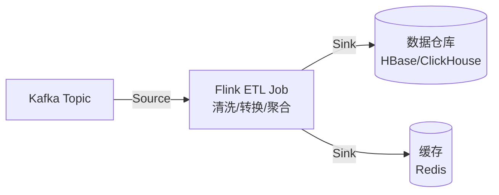
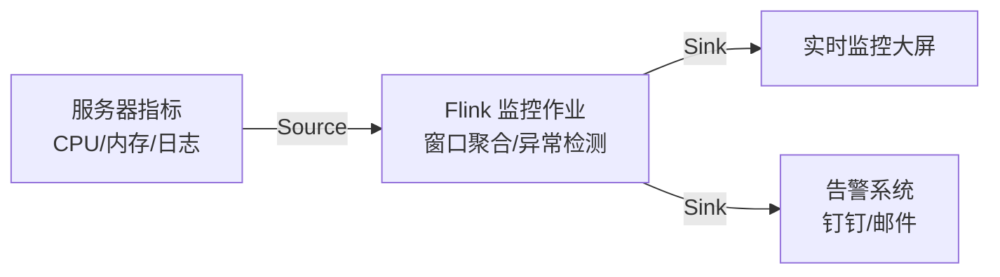
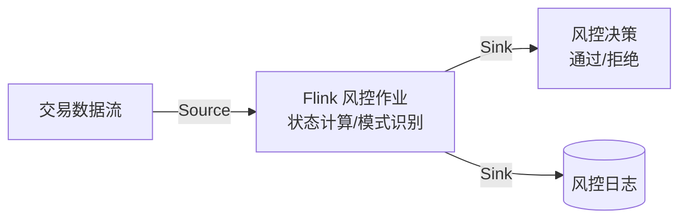

# Flink 常见问题解答 (FAQ)

## 1. 使用 Flink 一定要安装 Java 吗？

**是的，使用 Flink 必须安装 Java**。Flink 是用 Java 编写的分布式流处理框架，其核心运行时（JobManager、TaskManager）都是 Java 应用程序，必须在 JVM 上运行。

**所有使用方式都需要 Java**：Java/Scala API 直接需要；PyFlink（Python API）底层依赖 Flink Java 运行时，通过 Python-Java 桥接通信；Flink SQL Client 也需要 Java 环境。

**Java 版本要求**：最低 Java 8，推荐 Java 11 或 Java 17（LTS 版本），当前最佳选择是 Java 17。

**Docker 场景**：如果使用 Docker 运行 Flink，本地机器不需要安装 Java（容器镜像已包含），但容器内必须包含 Java 运行时。

## 2. Flink 最常用的三种应用场景

### 场景一：实时数据管道（ETL）

将 Kafka 等消息队列的数据实时清洗、转换后写入数据仓库或存储系统，实现分钟级数据可见性。



### 场景二：实时监控与告警

实时处理服务器指标、日志等数据流，进行窗口聚合和异常检测，触发实时告警。



### 场景三：金融风控

毫秒级识别异常交易模式（如短时间内多笔大额转账），基于状态计算实现实时反欺诈。



## 3. Flink 核心功能

- **低延迟流处理**：毫秒级响应实时数据，支持毫秒级延迟的流式计算
- **流批一体引擎**：同一套 API 处理流数据和批数据，统一开发体验
- **精确状态管理**：故障恢复后数据不丢不重，支持 Exactly-Once 语义
- **事件时间处理**：处理乱序数据保证结果准确，支持水印机制

总结：Flink 专为**有状态计算的流数据**设计，实现低延迟、强一致性、复杂状态管理的实时计算场景。

## 4. Flink 高可用和容错机制

Flink 通过 **Checkpoint 快照机制**和**高可用架构**实现故障恢复，核心不是数据冗余，而是状态快照恢复。

- **Checkpoint 机制**：定期为所有算子状态创建快照，存储到分布式存储系统（HDFS/S3），这些系统本身有冗余副本，保证 Checkpoint 的可靠性
- **高可用 JobManager**：支持多个 JobManager 实例，通过 ZooKeeper 或 Kubernetes 进行 Leader 选举，主节点故障时自动切换
- **故障恢复流程**：检测故障 → 停止作业 → 从最近 Checkpoint 恢复状态 → 重新调度任务 → 继续处理
- **Exactly-Once 保证**：通过 Checkpoint + 两阶段提交（2PC）协议，确保输出到外部系统的数据精确一次

**关键点**：Flink 不在运行时维护数据冗余，而是通过定期快照和状态恢复机制实现容错，依赖分布式存储系统的冗余来保证 Checkpoint 的可靠性。

## 5. Flink 高可用方式：ZooKeeper vs 嵌入式 Raft

Flink 支持两种高可用方式，用于 JobManager 的 Leader 选举和元数据管理。

- **基于 ZooKeeper 的高可用**：依赖外部 ZooKeeper 集群进行 Leader 选举，Checkpoint 元数据存储在 ZooKeeper 中。优势是成熟稳定、广泛使用；劣势是需要额外部署和维护 ZooKeeper 集群，增加运维复杂度。

- **基于嵌入式 Raft 的高可用**：Flink 内部实现 Raft 协议，无需外部依赖，直接在集群中进行 Leader 选举和元数据管理。优势是简化部署、降低运维成本；劣势是相对较新，需要深入理解 Raft 协议进行故障排查。

**版本支持**：Flink 新版本（如 1.17、1.18、1.19）同时支持 ZooKeeper 和嵌入式 Raft。嵌入式 Raft 不是强制或默认选项，而是为简化部署提供的选择。

## 6. JobManager 和 TaskManager 高可用配置的最佳实践

- **JobManager 配置**：建议配置 **2-3 个实例**实现高可用。1 个存在单点故障风险；2 个可提供基本高可用（1 主 1 备）；3 个更稳妥（1 主 2 备，可容忍 1 个故障）。通过 ZooKeeper 或嵌入式 Raft 进行 Leader 选举，主节点故障时自动切换。

- **TaskManager 配置**：数量根据**作业并行度和资源需求**动态调整，计算公式为 `TaskManager 数量 = 作业总并行度 / 每个 TaskManager 的 Slot 数`。建议每个 TaskManager 配置 2-4 个 Task Slot（根据 CPU 核心数），TaskManager 数量应**至少 2 个以上**避免单点故障。

- **Slot 说明**：Slot（任务槽）是 TaskManager 中的资源分配单元，每个 Slot 代表一部分内存和 CPU 资源，用于执行并行子任务。Slot 数量计算方式：`Slot 数 ≈ CPU 核心数`（通常为 2-4 个），集群总 Slot 数 = TaskManager 数量 × 每个 TaskManager 的 Slot 数，作业并行度不能超过集群总 Slot 数。

**典型生产配置**：2-3 个 JobManager（高可用）+ 3-10 个 TaskManager（根据业务规模和并行度动态调整）。

## 7. Flink 上游常用的工具或服务

Flink 常用的上游数据源工具或服务及其应用场景：

- **Kafka（消息队列）**：最常用的上游数据源，用于实时数据管道、事件驱动架构、日志聚合等场景。Kafka 作为数据缓冲层，解耦生产者和消费者，支持高吞吐、低延迟的数据流传输。

- **数据库（MySQL/PostgreSQL 等）**：通过 JDBC Source 或 CDC 工具（如 Debezium）连接，用于数据库变更实时捕获、数据同步、ETL 等场景。CDC 工具可将数据库变更事件实时推送到 Kafka，再由 Flink 消费处理。

- **文件系统（HDFS、本地文件、AWS S3）**：通过 File Source 读取文件数据，用于批处理、历史数据导入、日志文件处理等场景。支持文本、CSV、JSON 等格式。S3 作为云存储文件源，常用于 AWS 环境下的数据归档和批量处理。

- **AWS SQS（消息队列）**：Amazon Simple Queue Service，用于事件驱动架构、微服务通信、异步消息处理等场景。Flink 支持从 SQS 读取消息进行流处理，适合 AWS 生态系统的消息队列集成。

- **REST API**：通过自定义 Source 连接外部 API，用于第三方数据接入、实时数据采集等场景。

- **IoT 设备/传感器**：通过 MQTT、Kafka 等中间件接入物联网数据，用于实时监控、设备数据分析等场景。

**典型架构**：数据库/API → Kafka → Flink → 数据仓库/缓存，Kafka 作为统一的数据接入层，Flink 进行实时计算处理。

## 8. Flink 常用的下游工具或服务

Flink 常用的下游数据输出工具或服务及其应用场景：

- **Kafka（消息队列）**：最常用的下游输出，用于将处理后的数据写入新的 Kafka Topic，实现数据流转、事件发布、多消费者订阅等场景。支持 Exactly-Once 语义，保证数据不丢失不重复。

- **数据库（MySQL/PostgreSQL 等）**：通过 JDBC Sink 将处理结果写入关系型数据库，用于实时数据入库、ETL 结果存储、业务数据更新等场景。支持批量写入和事务保证。

- **数据仓库/OLAP（HBase、ClickHouse、Hive 等）**：用于实时数据写入数据仓库，支持实时报表、数据分析、OLAP 查询等场景。ClickHouse 适合实时写入和分析，HBase 适合大规模数据存储。

- **搜索引擎（Elasticsearch）**：通过 ES Sink 将数据实时同步到搜索引擎，用于实时搜索、日志分析、监控指标存储等场景。支持全文检索和复杂查询。

- **缓存（Redis）**：将计算结果写入 Redis，用于实时缓存更新、热点数据存储、实时排行榜等场景。支持低延迟的数据访问。

- **文件系统（HDFS、AWS S3）**：通过 File Sink 将数据写入文件系统，用于数据归档、批量导出、历史数据存储等场景。S3 常用于云环境下的数据存储和备份。

- **AWS SQS（消息队列）**：将处理结果发送到 SQS 队列，用于事件驱动架构、微服务通信、异步消息处理等场景，适合 AWS 生态系统集成。

**典型架构**：Flink 处理后的数据可同时输出到多个下游系统，实现数据分流和多场景应用，如实时写入数据库、同步到搜索引擎、更新缓存等。

## 9. PyFlink 初始化步骤

使用 PyFlink 库初始化 Flink 的基本步骤：

1. **导入模块**：根据使用的 API 导入相应模块（DataStream API 或 Table API）
2. **创建执行环境**：创建 StreamExecutionEnvironment 或 TableEnvironment
3. **添加依赖 JAR**：如使用 Kafka、文件系统等连接器，需添加对应的 JAR 包
4. **配置参数**：设置并行度、Checkpoint 等参数（可选）
5. **创建数据源和定义处理逻辑**：定义 Source、转换操作和 Sink
6. **执行作业**：调用 execute 方法启动作业

**DataStream API 初始化示例：**

```python
# Step 1: 导入模块
from pyflink.datastream import StreamExecutionEnvironment
from pyflink.datastream.connectors.kafka import KafkaSource
from pyflink.common.watermark_strategy import WatermarkStrategy

# Step 2: 创建执行环境
env = StreamExecutionEnvironment.get_execution_environment()

# Step 3: 添加依赖 JAR 包（如使用 Kafka 连接器）
env.add_jars("file:///path/to/flink-connector-kafka-1.17.0.jar")

# Step 4: 配置执行参数（可选）
env.set_parallelism(4)  # 设置并行度
env.enable_checkpointing(60000)  # 启用 Checkpoint，间隔 60 秒

# Step 5: 创建数据源和处理逻辑
source = KafkaSource.builder()...
data_stream = env.from_source(source, WatermarkStrategy.no_watermarks(), "kafka-source")
result = data_stream.map(...).filter(...)

# Step 6: 执行作业
env.execute("my-flink-job")
```

**Table API 初始化示例：**

```python
# Step 1: 导入模块
from pyflink.table import EnvironmentSettings, TableEnvironment

# Step 2: 创建执行环境（流处理模式）
stream_settings = EnvironmentSettings.in_streaming_mode()
table_env = TableEnvironment.create(stream_settings)

# 或批处理模式
# batch_settings = EnvironmentSettings.in_batch_mode()
# table_env = TableEnvironment.create(batch_settings)

# Step 3: 添加依赖 JAR 包（如使用 Kafka 连接器）
table_env.get_config().get_configuration().set_string(
    "pipeline.jars", 
    "file:///path/to/flink-connector-kafka-1.17.0.jar"
)

# Step 4: 配置执行参数（可选）
table_env.get_config().get_configuration().set_string("parallelism.default", "4")

# Step 5: 创建表和处理逻辑
table_env.execute_sql("CREATE TABLE source_table (...) WITH (...)")
table_env.execute_sql("CREATE TABLE sink_table (...) WITH (...)")

# Step 6: 执行作业
table_env.execute_sql("INSERT INTO sink_table SELECT * FROM source_table")
```

